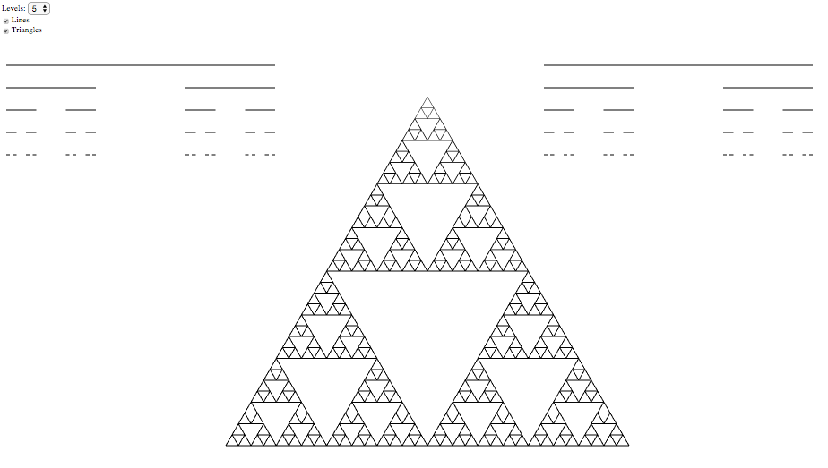

# Recursion - for kids

Two simple examples I used to explain recursion to my 9-year-old son (and wife).

See [Sierpinski](https://en.wikipedia.org/wiki/Sierpinski_triangle) on wikipedia.
And here's quite an incredible Sierpinski triangle sculpture made of golf balls in [Dale Seymour's house](http://www.daftmusings.com/a-tour-of-dale-seymours-house/) in Los Altos, CA.

